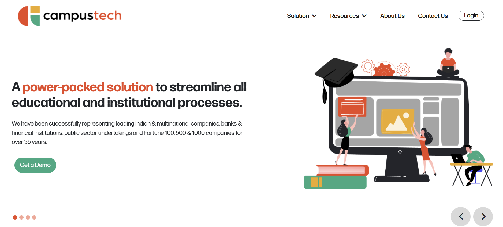
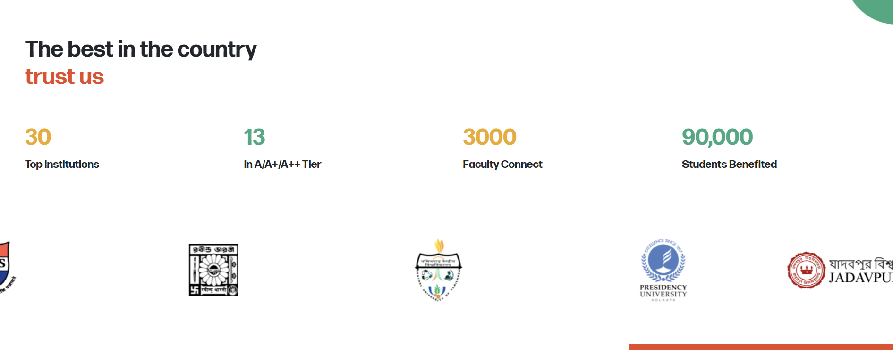

# 🎓 CampusTech

GrapDes CampusTech is an **interactive web platform** built to empower students and tech enthusiasts with the latest updates, resources, and events happening in the tech space on campus.

## 🚀 Key Features
- 🏫 **Explore Campus Tech Trends** – Stay updated with the latest in campus technology
- 📚 **Resource Library** – Access learning materials and guides
- 🎟️ **Workshops & Events** – Discover and register for tech events
- 💬 **Community Forum** – Engage in discussions with fellow tech enthusiasts
- 📢 **Announcements & News** – Stay informed about important updates

## 🖼️ Screenshots
## Home Page

## Slider Page


## 📂 Project Structure
```
GrapDes-CampusTech/
│── public/
│── src/
│   ├── components/
│   │   ├── Header/
│   │   │   ├── Navbar.js
│   │   │   ├── HeroSection.js
│   │   ├── Main/
│   │   │   ├── Resources.js
│   │   │   ├── Events.js
│   │   │   ├── Community.js
│   │   ├── Footer/
│   │   │   ├── Footer.js
│   ├── assets/
│   ├── styles/
│   ├── App.js
│   ├── index.js
│── package.json
│── README.md
```

## 🛠️ Tech Stack
- **HTML & CSS** – Core structure and styling
- **JavaScript** – Adds interactivity and dynamic behavior
- **React.js** – Dynamic frontend framework for a seamless UI
- **Bootstrap** – Responsive design and pre-built components
- **React Router** – Smooth navigation between pages

## 📌 How to Run the Project
1. Clone the repository:
   ```sh
   git clone https://github.com/singhkrishna01/Campus-Tech-Site
   ```
2. Navigate to the project folder:
   ```sh
   cd Campus-Tech-Site
   ```
3. Install dependencies:
   ```sh
   npm install
   ```
4. Start the development server:
   ```sh
   npm start
   ```
5. Open your browser and go to:
   ```sh
   http://localhost:3000
   ```

## 🎯 Future Enhancements
- 🔐 **User Authentication** – Enable login and personalized experience
- 🌙 **Dark Mode** – Provide an alternative theme for better accessibility
- 🏆 **Leaderboards & Challenges** – Encourage learning through gamification

## 📞 Contact
- **Email**: krishna00cs@gmail.com
- **Portfolio**: [krishna-singh.netlify.app](https://krishna-singh.netlify.app/)
- **LinkedIn**: [krishnasingh20](https://www.linkedin.com/in/krishnasingh20/)
